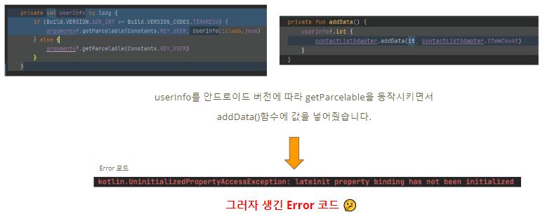
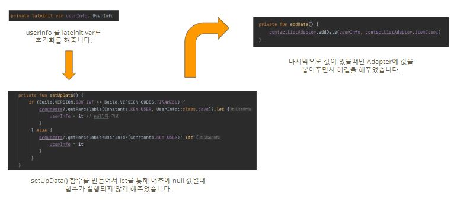
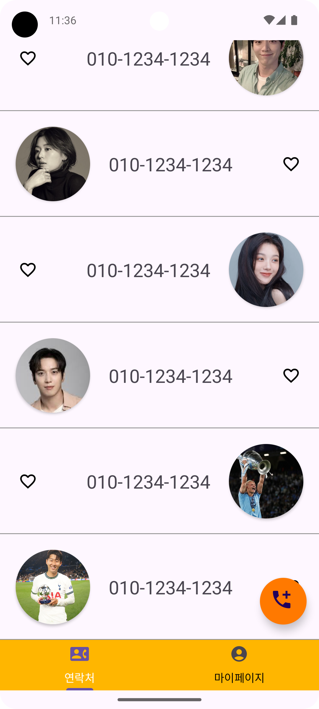
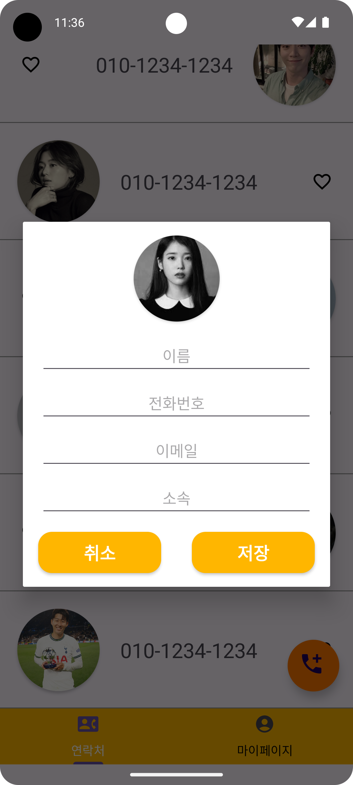
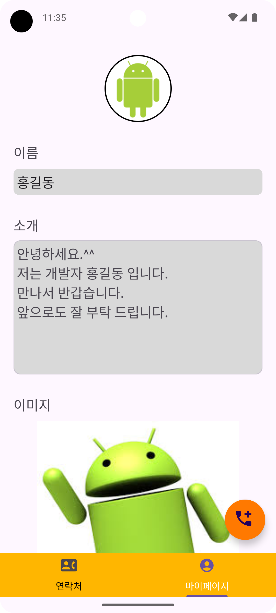

# 연락처 앱

## ✨주제

- 연락처 보여주기 및 마이페이지
- 플러팅 액션 버튼 클릭시 다이얼 로그 호출 및 데이터 추가

## 💻주요 기능


### 연락처 보여주기 및 마이페이지

- ViewPager를 통한 연락처와 마이페이지 간의 swipe 화면 전화
- 아래 바텀 탭의 클릭을 통한 화면 전환

### 플러팅 액션 버튼 클릭을 통한 다이얼로그 호출 및 데이터 추가

- 모든 화면의 플러팅 액션 버튼 클릭시 다이얼로그 화면 보여주기
- 다이얼로그의 데이터 입력 후 저장 유무에 따라 연락처에 데이터 추가
- 뒤로 가기 버튼 클릭시 메인 화면 이동, 상단의 뒤로 가기 버튼 클릭시 메인 화면 이동
  </br>


## ⚙ 트러블 슈팅


### Parcelable에 데이터 이동에 따른 문제
- 문제: Parcelable한 데이터를 전달 할 때 받는 곳에서 Deprecated 및 null 값 문제 발생
  
- 해결: SDK버전에 따른 Parcelable 데이터를 받는 로직 구현, let의 코틀린 스코프를 이용한 Null 처리
  

### 다이얼로그 버튼 문제

- 문제: 다이얼로그 기본 버튼과 xml에서 커스텀한 위젯 버튼 2개가 생성됨

- 해결: 코틀린 파일 내부에서
  ```
  //아래 코드를 이용하여 기본 버튼을 숨김
  builder.setPositiveButton("",null)
  ```
### 데이터 추가시 뷰가 반영되지 않는 문제 발생

- 문제: 각각의 다이얼로그에서 싱글톤 MutableList 형식에 객체에 데이터를 추가해주었지만 뷰에서 갱신하지 못함
- 해결: Interface의 callback과 ViewPager의 Listener를 통한 뷰 갱신

## 스크린샷
  


# contact
